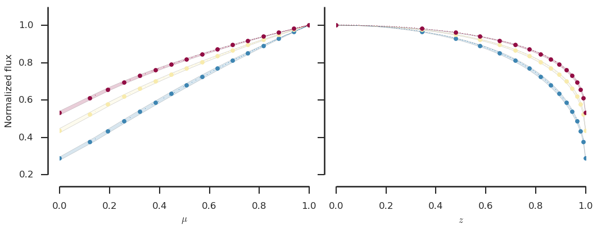
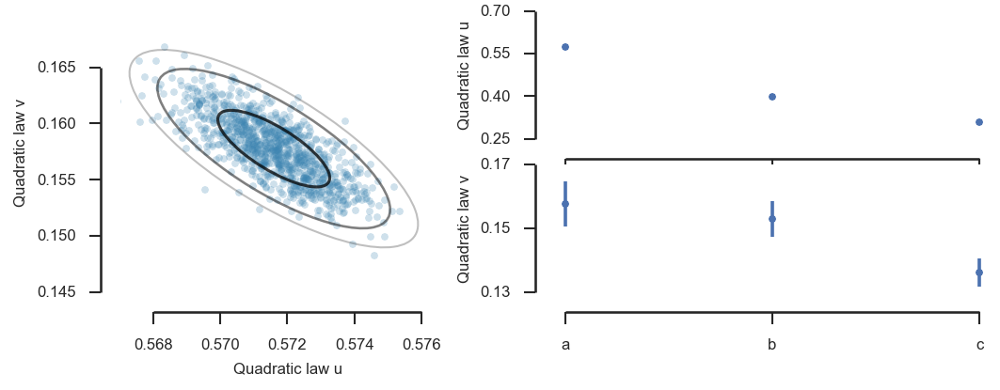
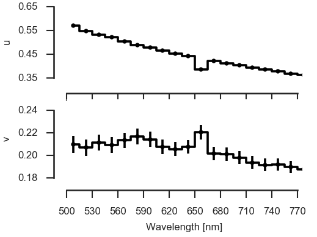

# LDTk

[](http://www.gnu.org/licenses/gpl-2.0.html)
[](http://mnras.oxfordjournals.org/content/453/4/3821.abstract)
[](http://arxiv.org/abs/1508.02634)
[](http://ascl.net/1510.003)
[](https://zenodo.org/badge/latestdoi/5871/hpparvi/ldtk)
[](http://www.astropy.org/)

Python **L**imb **D**arkening **T**ool**k**it - a Python toolkit for calculating stellar limb darkening profiles and model-specific coefficients for arbitrary passbands using the stellar spectrum model library by Husser et al (2013).

```python
from ldtk import LDPSetCreator, BoxcarFilter

filters = [BoxcarFilter('a', 450, 550),  # Define your passbands
           BoxcarFilter('b', 650, 750),  # - Boxcar filters useful in
           BoxcarFilter('c', 850, 950)]  #   transmission spectroscopy

sc = LDPSetCreator(teff=(6400,   50),    # Define your star, and the code
                   logg=(4.50, 0.20),    # downloads the uncached stellar
                      z=(0.25, 0.05),    # spectra from the Husser et al.
                     filters=filters)    # FTP server automatically.

ps = sc.create_profiles()                # Create the limb darkening profiles
cq,eq = ps.coeffs_qd(do_mc=True)         # Estimate quadratic law coefficients

lnlike = ps.lnlike_qd([[0.45,0.15],      # Calculate the quadratic law log
                       [0.35,0.10],      # likelihood for a set of coefficients
                       [0.25,0.05]])     # (returns the joint likelihood)

lnlike = ps.lnlike_qd([0.25,0.05],flt=0) # Quad. law log L for the first filter
```




...and the same, but for 19 narrow passbands...



## Overview

LDTk automates the calculation of custom stellar limb darkening (LD) profiles and model-specific limb darkening coefficients (LDC) using the library of PHOENIX-generated specific intensity spectra by Husser et al. (2013).

The aim of the package is to facilitate exoplanet transit light curve modeling, especially transmission
spectroscopy where the modeling is carried out for custom narrow passbands. The package can be  

1. used to construct model-specific priors on the limb darkening coefficients prior to the transit light curve modeling
2. directly integrated into the log posterior computation of any pre-existing transit modeling code with minimal modifications.

The second approach can be used to constrain the LD model parameter space directly by the LD profile, allowing for the marginalization over the whole parameter space that can explain the profile without the need to approximate this constraint by a prior distribution. This is useful when using a high-order limb darkening model where the coefficients are often correlated, and the priors estimated from the tabulated values usually fail to include these correlations.

## News

- Version 1.7 (22.7.2021)

    - Improved the way the stellar limb is defined. LDTk now fits an LD model together with a smoothstep function to
      find the edge of the star. This approach should remove the need for manual edge definition completely.
      
    - LDTk now resamples the original models to a linear sampling in mu since this makes LD coefficient estimation
      more straightforward.  

- Version 1.6 (4.5.2021)

    - Added `ldtk.SVOFilter` filter class that creates a filter using the [Spanish Virtual Observatory (SVO) Filter 
      Profile Service (FPS)](http://svo2.cab.inta-csic.es/theory/fps/). The FPS contains over 10000 named filters, and
      creating a filter based on the FPS data is now as simple as giving the `SVOFilter` the SVO filter name.

- Version 1.5 (3.3.2021)

    - LDTk can now use four different sets of the modelled stellar spectra: `vis`, `vis-lowres`, `visir`, and `visir-lowres`.
      The first, `vis`, is the original one by Husser et al (2013) spanning from 50 nm to 2600 nm; `vis-lowres` is a lower
      resolution version of the original dataset, binned to a 5 nm resolution; `visir` is a new version of the original
      model set extended to span from 50 nm to 5500 nm; and `visir-lowres` is a lower resolution version of the new model
      set binned to 5 nm resolution.
      
    - The model set can be chosen in the `LDPSetCreator` initialisation by setting the `dataset` argument. LDTk uses 
      `vis-lowres` as a default, but `visir-lowres` can be used when dealing with IR observations, and the original
      versions (`vis` and `visir`) can be used if a spectral resolution higher than 5 nm is required.

- Version 1.4

    - Added automatic detection and re-download of corrupted fits files (a highly welcome contribution by T. Fatahi).

- Version 1.3

    - Changed to calculate the limb darkening models using numba. This should give a significant performance boost.

- Version 1.2

    - Added an option to use *low resolution* version of the original specific intensity spectra. These spectra are binned to 
      5 nm resolution in wavelength and are kindly hosted by T. Husser at the same FTP server as the original spectra.
    - The behavior can be toggled with a new ``LDPSetCreator`` initialisation argument, ``lowres``.
    - **LDTk uses now low resolution spectra by default**. This is because the wavelength resolution should be good enough 
      for most broadband photometry analyses, and the this decreases the download times and file storage sizes significantly.

## Requirements
### Core requirements
- Python 2.7 or Python 3
- NumPy => 1.7
- SciPy => 0.16
- tqdm
- astropy

### Notebooks
- IPython => 3.0

## Installation

Use `pip`

    pip install [--user] [--upgrade] ldtk

or clone the source from github and follow the basic Python package installation routine

```bash
 git clone https://github.com/hpparvi/ldtk.git
 cd ldtk
 python setup.py build install [--user]
```

## Examples

Examples for basic and more advanced usage can be found from the `notebooks` directory.

## Model coefficient estimation

## Log likelihood evaluation
The ``LDPSet`` class offers methods to calculate log likelihoods for a set of limb darkening models.

 - ``lnlike_ln`` : Linear model
 - ``lnlike_qd`` : Quadratic model
 - ``lnlike_tq`` : Quadratic model with triangular parametrization (Kipping 2013)
 - ``lnlike_nl`` : Nonlinear model
 - ``lnlike_gn`` : General model
 - ``lnlike_p2`` : Power-2 model

## Resampling
The limb darkening profiles can be resampled to a desired sampling in ``mu`` using the resampling methods in the ``LDPSet``.

 - ``resample_linear_z(nz=100)``: Resample the profiles to be linear in z
 - ``resample_linear_mu(nmu=100)``: Resample the profiles to be linear in mu
 - ``reset_sampling()``: Reset back to native sampling in mu
 - ``resample()``:

## Main classes

 - LDPSetCreator : Generates a set of limb darkening profiles given a set of filters and stellar TEff, logg, and z.
 - LDPSet : Encapsulates the limb darkening profiles and offers methods for model coefficient estimation and log likelihood evaluation.

## Citing

If you use LDTk in your research, please cite the LDTk paper

    Parviainen, H. & Aigrain, S. MNRAS 453, 3821–3826 (2015) (DOI:10.1093/mnras/stv1857).

and the paper describing the spectrum library without which LDTk would be rather useless

    Husser, T.-O. et al. A&A 553, A6 (2013) (DOI:10.1051/0004-6361/201219058).

or use these ready made BibTeX entries

    @article{Parviainen2015,
      author = {Parviainen, Hannu and Aigrain, Suzanne},
      doi = {10.1093/mnras/stv1857},
      journal = {MNRAS},
      month = nov,
      number = {4},
      pages = {3821--3826},
      title = {{ldtk: Limb Darkening Toolkit}},
      url = {http://mnras.oxfordjournals.org/lookup/doi/10.1093/mnras/stv1857},
      volume = {453},
      year = {2015}
    }

    @article{Husser2013,
      author = {Husser, T.-O. and {Wende-von Berg}, S and Dreizler, S and Homeier, D and
                 Reiners, A and Barman, T. and Hauschildt, Peter H},
      doi = {10.1051/0004-6361/201219058},
      journal = {A{\&}A},
      pages = {A6},
      title = {{Astrophysics A new extensive library of PHOENIX stellar atmospheres}},
      volume = {553},
      year = {2013}
    }

## Author

Hannu Parviainen, University of Oxford

## Contributors

- Rainer Wichmann, Hamburger Sternwarte, Universität Hamburg
- [Tom Louden](https://github.com/tomlouden), University of Warwick
- [Ian Crossfield](https://github.com/iancrossfield), University of Arizona

--

Copyright © 2016 Hannu Parviainen <hannu.parviainen@physics.ox.ac.uk>
