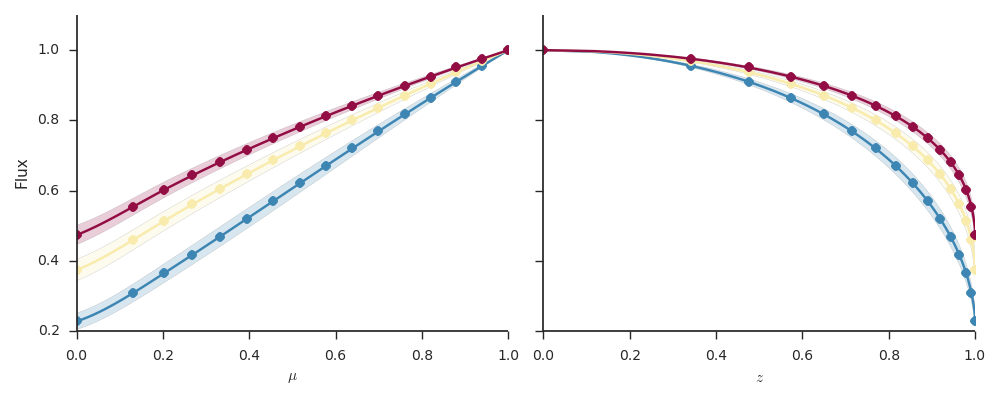

# PyLDTk
Python toolkit for calculating stellar limb darkening profiles and model-specific coefficients for arbitrary filters using the stellar spectrum model library by Husser et al (2013).

```python
from ldtk import LDPSetCreator, BoxcarFilter

filters = [BoxcarFilter('a', 450, 550),  # Define your passbands
           BoxcarFilter('b', 650, 750),  # - Boxcar filters useful in 
           BoxcarFilter('c', 850, 950)]  #   transmission spectroscopy

sc = LDPSetCreator(teff=(5200, 100),     # Define your star, and the code
                   logg=(4.50, 0.2),     # downloads the uncached stellar 
                      z=(0.25, 0.05),    # spectra from the Husser et al.
                   filters=filters)      # FTP server automatically.

ps = sc.create_profiles()                # Create the limb darkening profiles
cq,eq = ps.coeffs_qd(use_mc=True)        # Estimate quadratic law coefficients

lnlike = ps.lnlike_qd([[0.45,0.15],      # Calculate the quadratic law log 
                      [0.35,0.10],       # likelihood for a set of coefficients 
                      [0.25,0.05]])      # (returns the joint likelihood)

lnlike = ps.lnlike_qd([0.25,0.05],flt=0) # Quad. law log L for the first filter
```



## Overview

## Installation

 - LDPSetCreator : Generates a set of limb darkening profiles given a set of filters and stellar TEff, logg, and z.
 - LDPSet : Encapsulates the limb darkening profiles and offers methods for model coefficient estimation and log likelihood evaluation.

## Model coefficient estimation

## Log likelihood evaluation
The ``LDPSet`` class offers methods to calculate log likelihoods for a set of limb darkening models.

 - ``lnlike_ln`` : Linear model
 - ``lnlike_qd`` : Quadratic model
 - ``lnlike_nl`` : Nonlinear model
 - ``lnlike_gn`` : General model

## Resampling
The limb darkening profiles can be resampled to a desired sampling in ``mu`` using the resampling methods in the ``LDPSet``. 

 - ``resample_linear_z(nz=100)``: Resample the profiles to be linear in z
 - ``resample_linear_mu(nmu=100)``: Resample the profiles to be linear in mu
 - ``reset_sampling()``: Reset back to native sampling in mu
 - ``resample()``:

© 2015 Hannu Parviainen <hpparvi@gmail.com>
